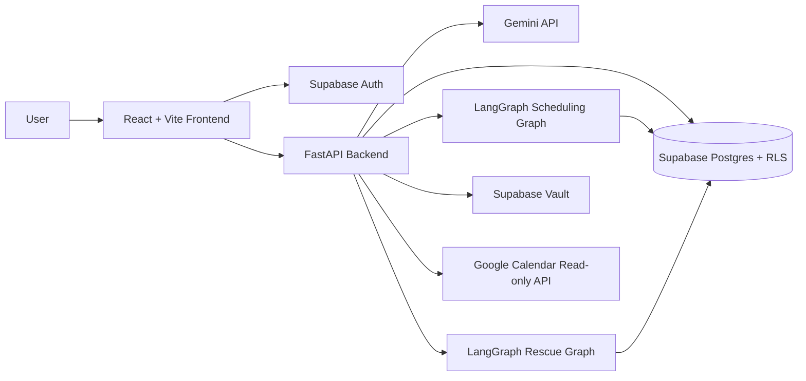
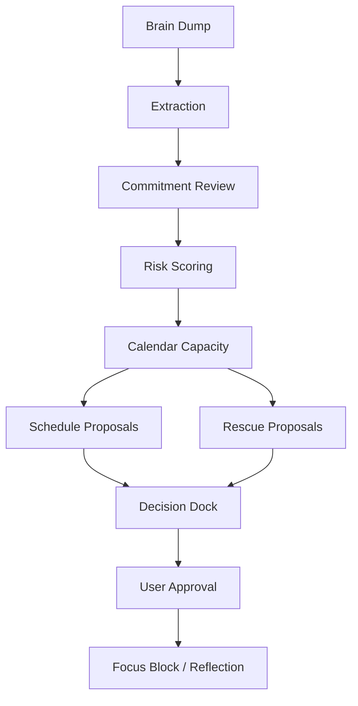

# ChronOS — A secure AI Time Operating System for deadline recovery

Turn messy commitments into executable recovery paths with human-approved AI planning.

## Product overview
ChronOS is an AI-powered time operating system that takes messy, unstructured brain dumps and extracts structured commitments. It checks real calendar capacity and risk levels to proactively predict deadline collapse. ChronOS agents then propose schedule and rescue actions (like focus blocks or scope reduction) which require explicit human approval before execution, allowing you to regain control of your time through a continuous reflection loop.

## Problem statement
People don't only forget tasks; they lose control when commitments, deadlines, limited energy, and strict calendar realities conflict. Traditional task managers wait for you to fail, while autonomous agents make risky decisions without context. ChronOS acts as a "last-minute life saver," predicting deadline collapse before it happens and offering safe, executable recovery paths.

## Why ChronOS is different
* **Not a reminder app**: ChronOS orchestrates multi-stage focus and execution paths.
* **Not a chatbot**: ChronOS provides a structured, calm UI driven by deterministic capacity and risk rules.
* **Not an autonomous assistant**: ChronOS acts *only* with explicit human permission.
* **A Time Operating System**: It features planning, risk assessment, rescue generation, and human approval in one cohesive loop.

## Feature list
* **Brain Dump Intake**: Paste unstructured text to generate organized tasks.
* **Commitment Clarifier**: AI clarifies ambiguous intent and sets structured deadlines.
* **Time Health / Risk Engine**: Deterministic rules compare effort against calendar reality.
* **Google Calendar Read-Only Capacity**: Syncs real-world busy blocks to accurately find free focus time.
* **Schedule Proposal Agent**: LangGraph-based stateful agent proposing deep work blocks.
* **Rescue Mode**: Intervenes on failing commitments with scope compression, deadline renegotiation, or urgent recovery blocks.
* **Decision Dock**: A consolidated UI queue for human review of all AI proposals.
* **Daily Command Brief**: At-a-glance dashboard of Time Health and next best actions.
* **Reflection Loop**: Log actual effort after focus blocks to improve future risk modeling.
* **Supabase Auth + Google Login**: Secure account management.
* **Supabase Vault token security**: Google OAuth tokens are stored securely in Supabase Vault, inaccessible to the frontend.
* **About / Guide documentation**: In-product explanations of agentic behaviors.

## Architecture



## Agentic workflow



## Safety model
* **ChronOS proposes; user approves.**
* No focus blocks are created without explicit user approval.
* No external emails or messages are sent.
* Calendar integration is strictly read-only.
* OAuth tokens are stored server-side securely through Supabase Vault.
* The frontend never receives Google OAuth tokens or backend secrets.

## Google technologies
* **Gemini API**: Used for structured intent extraction and plan explanation.
* **Google Calendar**: Read-only API access for calculating focus capacity.
* **Google OAuth**: For secure calendar connection via user authorization.
* **Google Login**: Seamless authentication through Supabase OAuth provider.

## Tech stack

| Layer | Technologies |
|---|---|
| **Frontend** | React, TypeScript, Vite, Tailwind |
| **Backend** | FastAPI, Python, Pydantic |
| **AI / Agent** | Gemini, LangGraph |
| **Database/Auth** | Supabase Postgres, RLS, Supabase Auth, Supabase Vault |
| **Integrations** | Google Calendar API, Google OAuth |
| **Testing** | Pytest, Vite build / TypeScript |

## Local setup instructions

### Supabase Setup
Start your local Supabase instance to provision the database and Vault.
```bash
supabase start --ignore-health-check
supabase db reset
supabase status
```
*Note: Make sure to note your local API URL and Anon Key from the status output.*

### Backend Setup
Run the FastAPI backend.
```bash
cd backend
python -m venv venv
# Windows: .\venv\Scripts\activate
# Mac/Linux: source venv/bin/activate
pip install -r requirements.txt
python -m pytest
python -m uvicorn app.main:app --reload
```
*Expected local URL: `http://127.0.0.1:8000`*

### Frontend Setup
Run the Vite/React frontend.
```bash
cd frontend
npm install
npm run build
npm run dev
```
*Expected local URL: `http://localhost:5173`*

### Stopping the system
To stop your local database environment:
```bash
supabase stop
supabase status
```

## Environment variables

### Backend (`backend/.env`)
* `SUPABASE_URL` (From `supabase status`)
* `SUPABASE_ANON_KEY`
* `SUPABASE_SERVICE_ROLE_KEY`
* `DEV_USER_ID` (Optional fallback for local bypass)
* `GEMINI_API_KEY`
* `GOOGLE_CLIENT_ID`
* `GOOGLE_CLIENT_SECRET`
* `GOOGLE_REDIRECT_URI`
* `GOOGLE_SCOPES`
* `FRONTEND_URL`

### Frontend (`frontend/.env`)
* `VITE_API_URL` (e.g. `http://127.0.0.1:8000`)
* `VITE_SUPABASE_URL`
* `VITE_SUPABASE_ANON_KEY`

> **WARNING**: Never commit `.env`, `backend/.env`, or `frontend/.env`.

## Manual Test Values

When running the application locally, use these manual test credentials to verify authentication and processing logic:

**Signup Validation Checks:**
* **Invalid email**: `dhruv` / Password: `Chronos123!`
* **Weak password**: `testuser@example.com` / Password: `password`
* **Mismatch**: Password `Chronos123!` / Confirm `Chronos456!`

**Valid Signup/Login:**
* Use a valid test email (e.g. `testuser1@example.com`)
* Password: `Chronos123!`
* *Wait for the verification message and check your local Supabase Inbucket for the verification link if email confirmation is enabled.*

**Sample Brain Dump (Inbox):**
Paste the following into the Inbox to test intent extraction:
> "I need to submit my final hackathon demo by tonight 11:30 PM. I still need to record the walkthrough, fix the README, deploy the frontend, and test Google login. I also have a college assignment due tomorrow morning and a team call at 8 PM."

## Auth setup notes
To use authentication locally or in production, configure your Supabase Dashboard:
* Enable **Email/Password** Auth.
* Enable **Confirm email** (Email Verification).
* Configure the **Google Provider** in Authentication -> Providers.
* Configure **Redirect URLs** (e.g., `http://localhost:5173/auth/callback` or production equivalent).
* Ensure the frontend uses the correct callback route to exchange OAuth hashes.

## Demo flow
1. Sign up or log in.
2. Open Command dashboard.
3. Scroll down and click **Load Judge Demo** from Connections & Demo Tools.
4. Click **Run ChronOS Analysis**.
5. Review the updated **Daily Command Brief** and Time Health.
6. Expand **Pending Approvals** to view proposed actions securely grouped by commitment.
7. Approve/reject a proposed action.
8. Review the Rescue, Focus, and Reflection flow in the Active Focus Console.

## Screenshots

> Add screenshots before final submission:
> - Landing
> - Command Brief
> - Decision Dock
> - Inbox
> - About/Guide

## Roadmap
* **Phase 7B**: Sprint Mode + First 15 Minutes + Starter Asset Generator
* **Phase 7D**: Drift/Avoidance Detector + Adaptive Replan
* **Phase 7E**: Final polish + deployment + submission packaging
* **Optional**: Gmail read-only commitment extraction

## Limitations
* Calendar integration is read-only.
* No autonomous calendar write-back.
* No external email sending capabilities.
* Mobile polish may need more targeted media queries.
* Gmail extraction is deferred to a future phase.

## Contribution status
Built for a hackathon submission, but strictly structured as a real product foundation with enterprise-grade security and RLS data isolation.
