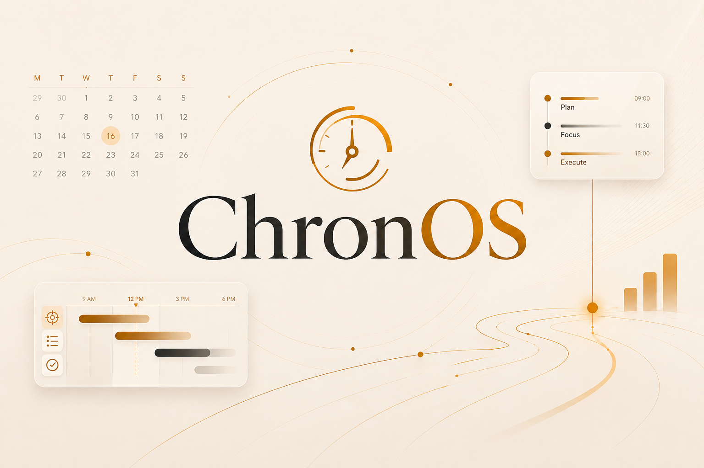

<div align="center">



# ChronOS

### Plan the day you can actually execute.

**ChronOS turns scattered commitments, projects, routines, working preferences, and calendar constraints into realistic plans — then helps repair those plans when reality changes.**

[**Live Product**](https://chronos-dhruv.netlify.app) · [**Public Demo**](https://chronos-dhruv.netlify.app/demo) · [**Video Demo**](https://youtu.be/D_iNyoHNXs0)

</div>

---

## What ChronOS is

ChronOS is a full-stack personal execution system for knowledge workers and advanced students.

Most planning tools are good at storing tasks. ChronOS focuses on the harder part: deciding **what can realistically fit**, protecting the user from impossible schedules, preserving context across projects, and recovering when a plan stops matching reality.

The product operates around a simple execution loop:

1. **Capture** work and context.
2. **Validate** it against capacity, fixed commitments, protected time, dependencies, and preferences.
3. **Plan** the day or week with deterministic feasibility checks.
4. **Explain** why work was prioritized, deferred, or rejected.
5. **Focus** on the next executable block.
6. **Recover** when interruptions, underestimation, blockers, or calendar changes invalidate the plan.
7. **Learn carefully** from confirmed preferences, reflections, notes, and prior choices.

ChronOS is recommendation-first. AI assists with interpretation, planning, retrieval, explanation, and recovery proposals. Deterministic rules still own feasibility, overlap detection, capacity, permissions, approvals, and persistence.

---

## Core capabilities

### Capture and structure

- Natural-language Inbox capture
- Structured extraction of tasks, deadlines, outcomes, and project context
- Review before persistence
- External-source proposals remain separate until explicitly approved

### Capacity-aware planning

- Daily and weekly planning
- Personal work hours, focus limits, transition buffers, and protected time
- Fixed calendar events and schedule conflicts
- Over-capacity detection
- Projects, Outcomes, Routines, and weekly planning
- Atomic approval of proposed plan changes

### Focus and recovery

- Start, pause, resume, finish, and stop focus sessions
- Contextual reflection after execution
- Deterministic stuck states
- Recovery flows for:
  - interruption
  - overload
  - ambiguity
  - blocked dependencies
  - underestimation
  - low energy
  - calendar disruption
- Approval-first recovery proposals instead of silent plan mutation

### Memory and context

- Explicit and inferred memory with confirmation
- Provenance, conflict review, expiry, export, and deletion
- Text, Markdown, project-context, and text-based PDF ingestion
- Hybrid lexical + vector retrieval
- Bounded context packs for planning, recovery, reflection, and project work
- Source attribution without exposing hidden reasoning or raw embeddings

### Integrations

ChronOS uses a **read-first integration model**.

- Google Calendar architecture and read-only synchronization
- Connector foundations for Gmail, GitHub, Notion, Outlook Calendar, Obsidian imports, and Microsoft Planner
- Normalized external context and auditable proposals
- Scoped MCP server/client foundation
- Typed permissions, request budgets, allow-lists, and validation
- No unrestricted remote MCP execution
- No general-purpose external write executor

> Integration foundations are intentionally separated from provider-live guarantees. A connector is not treated as fully production-validated until its real provider flow has been exercised end to end.

---

## Product principles

ChronOS is built around a few non-negotiable rules:

- **Deterministic feasibility outranks model preference.**
- **User approval outranks automation convenience.**
- **Explicit memory outranks inferred memory.**
- **Provenance outranks unsupported summarization.**
- **Planning should adapt to available capacity instead of pretending capacity is infinite.**
- **Recovery should preserve continuity rather than punish a broken streak or missed block.**

This is why ChronOS does not behave like a chat interface wrapped around a task manager. The model proposes; the system validates.

---

## Architecture

```text
Browser
  React + TypeScript + Vite + TanStack Query
            │
            │ authenticated HTTPS API
            ▼
FastAPI application
  APIs · services · Strategy Engine · bounded workflows
  deterministic validators · approval boundaries
            │
            ├── Groq generation gateway
            ├── Embedding gateway
            ├── Read-first integration adapters
            ├── Context / retrieval layer
            └── Supabase repositories
                        │
                        ▼
Supabase
  PostgreSQL · Auth · RLS · pgvector · Vault · transactional RPCs
```

### Main repository areas

| Path | Responsibility |
|---|---|
| `frontend/` | React product UI, protected routes, public demo, accessibility, and server-state handling |
| `backend/app/api/` | Typed FastAPI endpoints and authenticated product contracts |
| `backend/app/services/` | Planning, context, lifecycle, readiness, and domain services |
| `backend/app/workflows/` | Bounded intake, planning, recovery, approval, and tool workflows |
| `backend/app/repositories/` | Persistence protocols, Supabase adapters, and test fakes |
| `backend/app/models/` | Provider-neutral model gateway and Groq implementation |
| `backend/app/embeddings/` | Embedding contract, semantic provider path, and deterministic offline fallback |
| `backend/app/integrations/` | Connector contracts, normalization, synchronization, permissions, and audit behavior |
| `backend/app/mcp/` | Scoped MCP server/client foundation |
| `supabase/migrations/` | Append-only schema, RLS, grants, pgvector, Vault, and transactional functions |
| `docs/` | Product, architecture, security, evaluation, operations, testing, and deployment documentation |

---

## Technology

### Frontend
- React 19
- TypeScript
- Vite
- Tailwind CSS
- TanStack Query
- Supabase browser authentication
- Vitest + Testing Library

### Backend
- Python 3.12
- FastAPI
- Pydantic
- Supabase Python client
- Groq through a provider-neutral model gateway
- Google Calendar API integration layer
- `pypdf`
- Pytest

### Data and infrastructure
- Supabase PostgreSQL
- Row Level Security
- pgvector
- Supabase Vault
- Netlify frontend deployment
- Render backend deployment

---

## Reliability and evaluation

ChronOS is tested as a system, not only as a collection of isolated UI components.

Current verified regression baseline:

- **158 backend tests** in the default Python suite after deployment-host hardening
- **37 frontend tests**
- frontend typecheck, lint, and production build
- append-only Supabase migration chain through **028**
- two-user/RLS isolation coverage
- atomic transaction coverage
- security and deployment configuration tests
- **105 manually curated synthetic evaluation cases** across the shared evaluation framework

Live/provider-dependent suites remain opt-in so CI does not silently depend on external credentials or mutable provider state.

The context/retrieval layer also includes deterministic evaluation support. Synthetic retrieval metrics are treated as diagnostics, not as evidence of production-level retrieval quality.

---

## Security and control model

ChronOS assumes that model output, retrieved documents, integration payloads, emails, and MCP responses are untrusted.

Key controls include:

- Supabase-authenticated identity rather than user IDs supplied by request payloads
- RLS and explicit ownership scoping
- service-role-only operations where required
- restricted `SECURITY DEFINER` search paths and narrow grants
- explicit approval before consequential plan mutations and external writes
- bounded files, requests, retries, workflow steps, provider calls, and quotas
- safe source attribution without exposing embeddings or hidden reasoning
- redacted logs and correlation IDs
- export, source deletion, connection revocation, retention, and account deletion controls
- host-header validation and production CORS configuration

See [`docs/architecture/SECURITY_MODEL.md`](docs/architecture/SECURITY_MODEL.md).

---

## Deployment

ChronOS is currently deployed as a split application:

| Layer | Deployment |
|---|---|
| Frontend | [Netlify](https://chronos-dhruv.netlify.app) |
| Backend | [Render](https://chronos-7mar.onrender.com) |
| Database / Auth / RLS / Vault / vectors | Supabase |
| Generation | Groq |
| Embeddings | Provider-neutral embedding gateway |

Public backend liveness:

```text
https://chronos-7mar.onrender.com/api/v1/health/live
```

The deterministic `local_hash` embedding path exists for offline development and testing. It is not presented as a semantic production embedding model.

Deployment and environment guidance: [`docs/engineering/DEPLOYMENT.md`](docs/engineering/DEPLOYMENT.md).

---

## Public demo

You can explore the product without creating an account:

**Public demo:**  
https://chronos-dhruv.netlify.app/demo

The demo walks through a representative ChronOS day:

```text
Capture
→ validate constraints
→ build a workable plan
→ explain trade-offs
→ focus
→ recover when reality changes
→ inspect context and reliability boundaries
```

**Video walkthrough:**  
https://youtu.be/D_iNyoHNXs0

---

## Local development

### Prerequisites

- Python 3.12
- Node.js 22
- npm
- Docker Desktop
- Supabase CLI

### 1. Clone and configure

```powershell
git clone <repository-url>
cd chronos

Copy-Item backend\.env.example backend\.env
Copy-Item frontend\.env.example frontend\.env
```

Keep service-role keys, model-provider keys, OAuth secrets, encryption keys, and integration secrets in the backend environment only.

### 2. Start Supabase

```powershell
supabase start --ignore-health-check
supabase status
```

The repository uses local Supabase ports `55321`–`55324`.

For a clean disposable local database:

```powershell
supabase db reset
supabase migration list --local
```

### 3. Start the backend

Install dependencies only when creating the environment or when dependency manifests change.

```powershell
cd backend
py -3.12 -m venv venv
.\venv\Scripts\activate

python -m pip install -r requirements.txt
python -m pip install -r requirements-dev.txt

python -m uvicorn app.main:app --reload
```

Backend:

```text
http://127.0.0.1:8000
```

### 4. Start the frontend

```powershell
cd frontend
npm install
npm run dev
```

Frontend:

```text
http://127.0.0.1:5173
```

---

## Verification

### Backend

```powershell
cd backend
.\venv\Scripts\activate

python -m pytest
pip check
```

### Frontend

```powershell
cd frontend

npm run typecheck
npm run lint
npm run test -- --run
npm run build
```

### Database

```powershell
supabase status
supabase migration list --local
```

Live integration/provider tests are intentionally opt-in and require explicit credentials.

---

## Environment boundaries

The browser receives only public client configuration:

```env
VITE_API_URL=...
VITE_SUPABASE_URL=...
VITE_SUPABASE_ANON_KEY=...
```

Backend-only secrets include:

- `SUPABASE_SERVICE_ROLE_KEY`
- `GROQ_API_KEY`
- semantic embedding-provider credentials
- OAuth client secrets
- `GOOGLE_OAUTH_STATE_SECRET`
- `ENCRYPTION_KEY`
- integration/MCP allow-lists
- workflow, retry, timeout, quota, CORS, and allowed-host configuration

See [`backend/.env.example`](backend/.env.example) for the complete environment contract.

---

## Documentation

### Product
- [Product strategy](docs/product/PRODUCT_STRATEGY.md)
- [Strategy Engine](docs/product/STRATEGY_ENGINE.md)
- [UX principles](docs/product/UX_PRINCIPLES.md)

### Architecture and security
- [System architecture](docs/architecture/SYSTEM_ARCHITECTURE.md)
- [Agent runtime](docs/architecture/AGENT_RUNTIME.md)
- [Context and memory](docs/architecture/CONTEXT_MEMORY.md)
- [Integration model](docs/architecture/INTEGRATION_MODEL.md)
- [Security model](docs/architecture/SECURITY_MODEL.md)

### Engineering and operations
- [Development](docs/engineering/DEVELOPMENT.md)
- [Testing](docs/engineering/TESTING.md)
- [Evaluation system](docs/engineering/EVALUATION_SYSTEM.md)
- [Observability](docs/engineering/OBSERVABILITY.md)
- [Operations and recovery](docs/engineering/OPERATIONS.md)
- [Deployment](docs/engineering/DEPLOYMENT.md)

---

## Project status

ChronOS is complete as the current portfolio/product release.

The core product journey, planning engine, focus/recovery flows, personalization, context layer, approval boundaries, operational controls, deployment path, public demo, and production application are all implemented.

Further work is normal product evolution: deeper provider validation, additional integrations, stronger retrieval quality, richer observability, and broader platform support.

---

## Author

**Dhruv Gupta**

AI Systems Builder · Agentic AI · RAG · Full-stack AI Products

[GitHub](https://github.com/Dhruvg334) · [LinkedIn](https://www.linkedin.com/in/dhruv-gupta-7a7500287/) · [Live ChronOS](https://chronos-dhruv.netlify.app)
